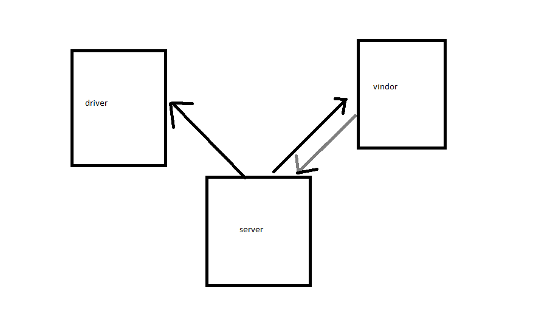

# CAPS

## Class-17

### CAPS

#### Links

[PR](https://github.com/YazanAlaiwah-401-advanced-javascript/notes/pull/2)

#### Modules

_`caps.js`_
_`driver.js`_
_`vendor.js`_

<!-- #### Setup

the program used in commad line all commads aftter _node index.js_
if you need help type `--help` or `-h`
to add note type `--add` or `-a` and the note
to have the note in a new catogery type `--category` or `-c` and the category (by defulte its general)
to see all the note type `--list` or `-l` -->

<!-- > to see one category type aftter it the name of it
> to updata the note type `--updata` or `-u` and the id of the note aftter it the updata it note
> node index.js -u <id> <new note>
> to delete the note type `--delete` or `-d` and the id of the note -->

#### Tests

Lint test: npm run lint
unit test: npm test

#### UML

